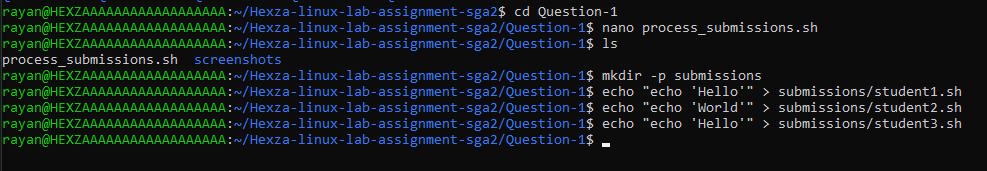
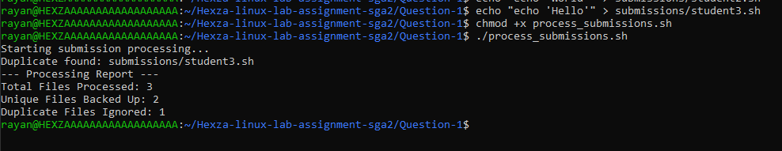
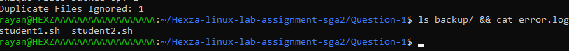

# Question 1: Duplicate Submission Checker

## Command 1
```bash
mkdir -p submissions
echo "echo 'Hello'" > submissions/student1.sh
echo "echo 'World'" > submissions/student2.sh
echo "echo 'Hello'" > submissions/student3.sh
```
**Explanation:** I created a `submissions` directory and added three dummy shell files. Two files contain the same content so the script can detect duplicates.



## Command 2
```bash
chmod +x process_submissions.sh
./process_submissions.sh
```
**Explanation:** I made the script executable and ran it. The script scanned the submission files, found the duplicate content, and generated the report and backup output.



## Command 3
```bash
ls backup/
cat error.log
```
**Explanation:** I verified that the backup directory was created and checked the error log. This confirmed that the script recorded the duplicate submission properly.


