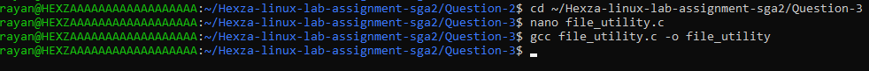
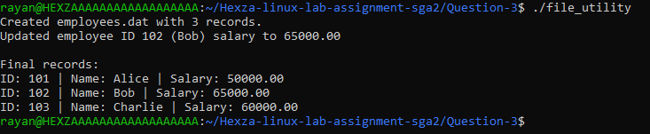
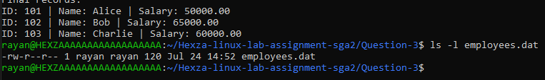

# Question 3: Low-Level File I/O (Employee Records)

## Command 1
gcc file_utility.c -o file_utility
**Explanation:** Compiled the C program with no errors, confirming the low-level file I/O logic using open(), read(), write(), and lseek() was correct.

## Command 2
./file_utility./file_utility
**Explanation:** The program created employees.dat and wrote 3 employee records to it, then used lseek() to locate employee ID 102 (Bob), updated his salary from 50000 to 65000 directly in the binary file, and printed all final records to confirm the update persisted.

## Command 3
ls -l employees.dat
**Explanation:** Confirmed the binary file employees.dat was created on disk at 120 bytes (3 records x 40 bytes each), matching the expected struct size.

