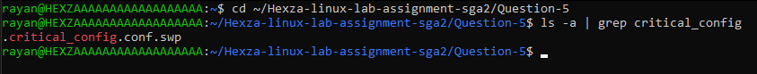
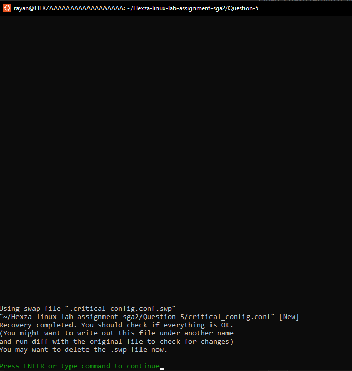

# Question 5: vi Recovery

## Command 1
```bash
vi critical_config.conf
```
**Explanation:** Opened the configuration file in vi and entered unsaved content to simulate a crash scenario.


## Command 2
```bash
ls -a | grep critical_config
```
**Explanation:** Verified that vi created a swap file after the crash, which confirms recovery data is available.



## Command 3
```bash
vi -r critical_config.conf
```
**Explanation:** Recovered the unsaved content from the swap file and confirmed the data was restored.


